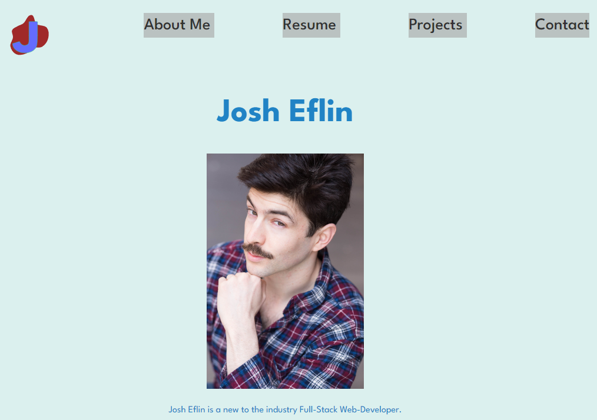

# Web-Dev Portfolio

## Description
This repository is my professional portfolio built with react and typescript using vite

## Table of Contents
- [License](#license)
- [Deployment](#deployment)
- [Screenshot](#screenshot)
- [Installation](#installation)
- [Usage](#usage)
- [Contributing](#contributing)
- [Tests](#tests)
- [Questions](#Questions)

## License
This repository is licensed under
   MIT

## Deployment
https://josheflin.github.io/portfolio-react/

## Screenshot

## Installation
there are no install steps

## Usage
Use this repository to check out my skills

## Contributing
Do not contribute to my portfolio

## Tests
This application doesn't need tests

## Questions

Feel free to peruse my git hub profile here:
https://github.com/JoshEflin

Or send an email to:
eflinjh@gmail.com
with  any further questions.

  
 
